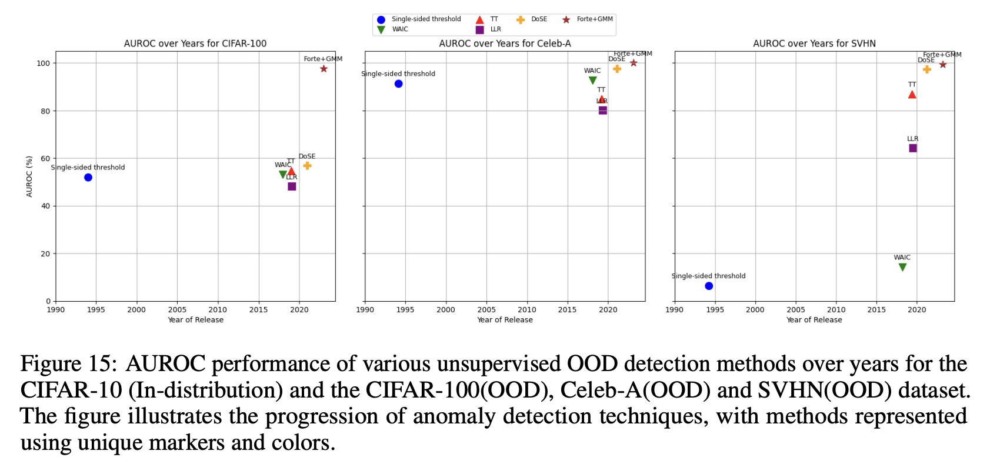
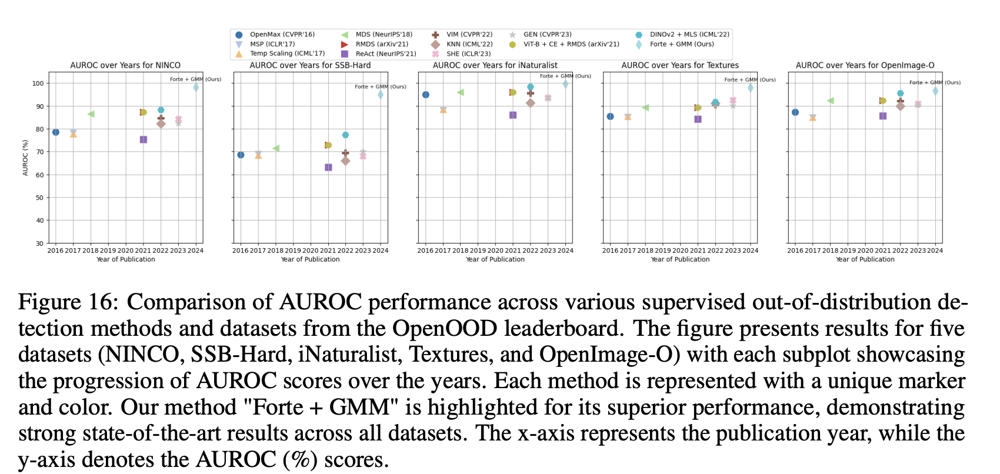

# Forte: Finding Outliers Using Representation Typicality Estimation

[](https://opensource.org/licenses/MIT)

## Why OOD?

Out-of-Distribution (OOD) detection is possibly the most important problem for safe and deployable ML:

1. Provides the first line of defense by preventing silent failures in critical ML systems
2. Bounds AI capabilities by recognition of model knowledge
3. Allows safe fallback and enables human oversight when needed

## Why Forte?

Forte takes a novel approach to OOD detection with several key advantages:

1. Utilizes self-supervised representations to capture semantic features
2. Incorporates manifold estimation to account for local topology
3. Minimizes deployment overhead; eliminates additional model training requirements
4. Requires no class labels, no exposure to OOD data during training, and no restrictions to architecture of predictive or generative models
5. Strong domain generalization – tested on detecting synthetic data, MRI images etc.

## Key Innovation

Forte treats OOD Detection as middleware in deployments. The approach is designed to be plug-and-play, requiring minimal setup and configuration.

## Quick Start

```bash
# Clone the repository
git clone https://github.com/DebarghaG/forte.git
cd forte

python3 -m venv env
source env/bin/activate

# Install dependencies
pip install scikit-learn numpy scipy transformers torch torchvision PIL tqdm
```

### Basic Usage

Simply provide your data folders:

```bash
python main.py --id_images_directories '../data/imagenet_1k' \
    --id_images_names imagenet1k \
    --ood_images_directories '../data/inaturalist_images' \
    --ood_images_names inaturalist_images \
    --batch_size 512 \
    --device cuda:0 \
    --embedding_dir ../embeddings/ \
    --num_seeds 5 \
    --run_baselines False
```

## Technical Approach

Forte combines representation learning with statistical estimation:

1. Uses self-supervised models to extract semantic features from images
2. Estimates typical sets using nearest neighbor statistics
3. Applies density estimation (KDE, OCSVM, or GMM) on the distribution of in-distribution data
4. Evaluates samples using precision, recall, density, and coverage metrics

The method achieves strong state-of-the-art (SoTA) performance across various benchmarks and real-world applications.




## Citation

```bibtex
@misc{ganguly2024fortefindingoutliers,
      title={Forte : Finding Outliers with Representation Typicality Estimation}, 
      author={Debargha Ganguly and Warren Morningstar and Andrew Yu and Vipin Chaudhary},
      year={2024},
      eprint={2410.01322},
      archivePrefix={arXiv},
      primaryClass={cs.LG},
      url={https://arxiv.org/abs/2410.01322}, 
}
```

## License

This project is licensed under the MIT License - see the [LICENSE](LICENSE) file for details.

## Acknowledgments

Research supported by ICICLE AI Institute.